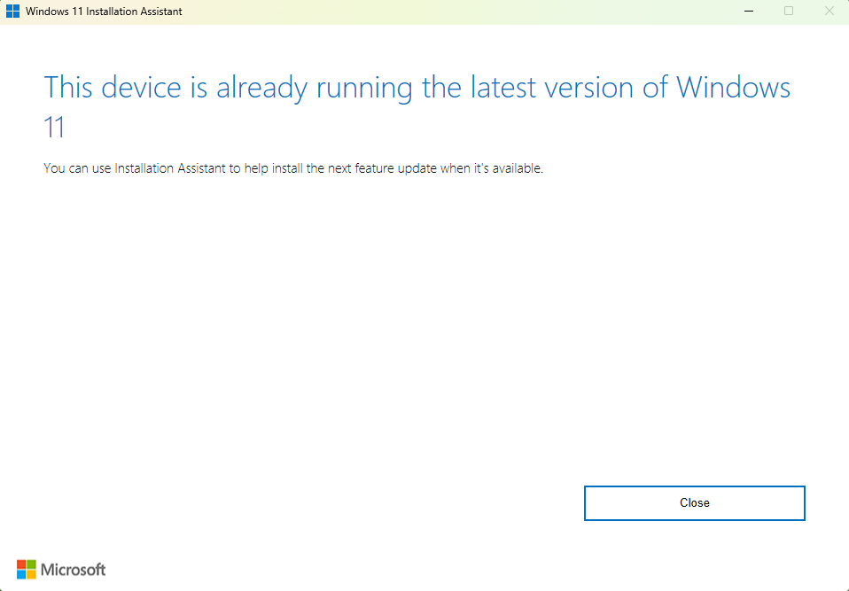
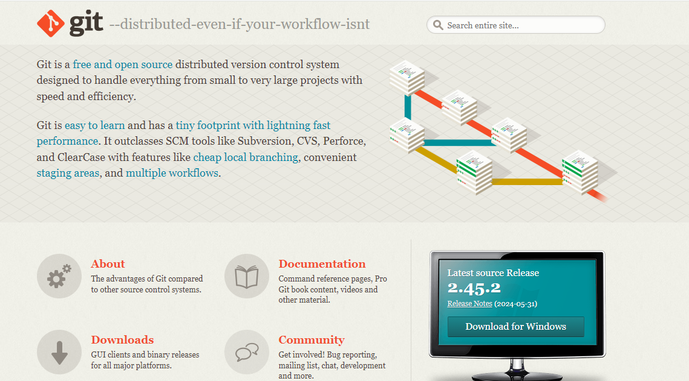
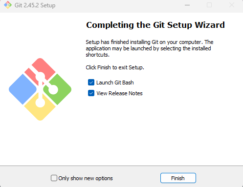
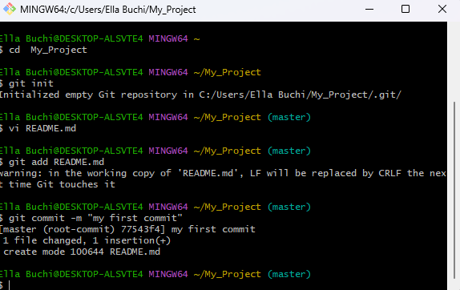
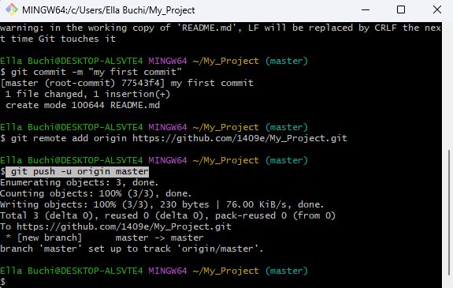
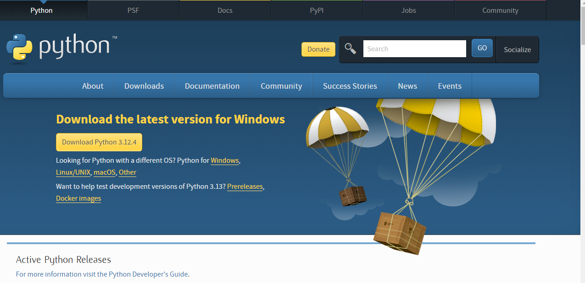
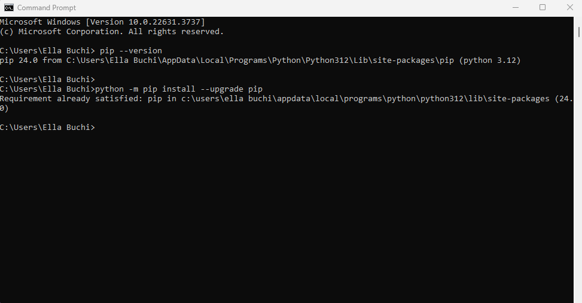
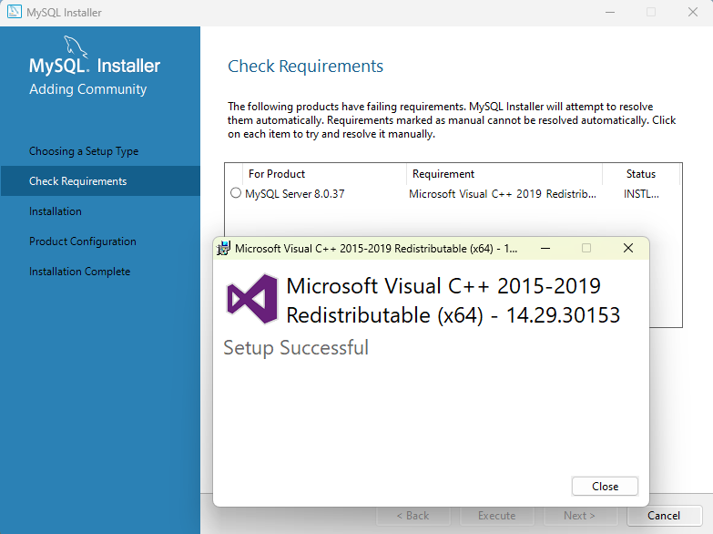
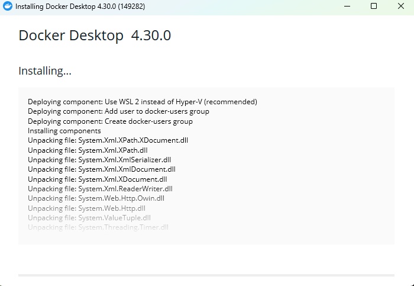
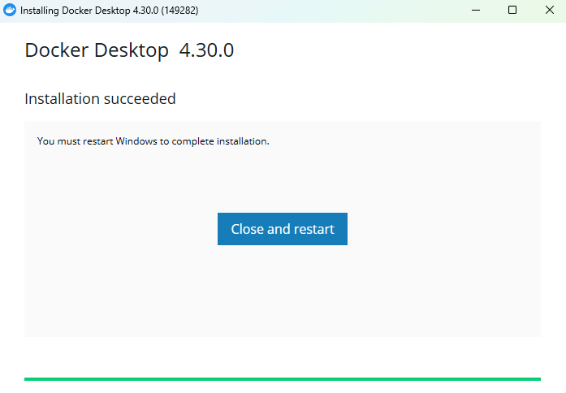

k

# Dev_Setup
Setup Development Environment

#Assignment: Setting Up Your Developer Environment

#Objective:
This assignment aims to familiarize you with the tools and configurations necessary to set up an efficient developer environment for software engineering projects. Completing this assignment will give you the skills required to set up a robust and productive workspace conducive to coding, debugging, version control, and collaboration.

#Tasks:

1. Select Your Operating System (OS):
   Choose an operating system that best suits your preferences and project requirements. Download and Install Windows 11. https://www.microsoft.com/software-download/windows11
2. Install a Text Editor or Integrated Development Environment (IDE):
   Select and install a text editor or IDE suitable for your programming languages and workflow. Download and Install Visual Studio Code. https://code.visualstudio.com/Download
3. Set Up Version Control System:
   Install Git and configure it on your local machine. Create a GitHub account for hosting your repositories. Initialize a Git repository for your project and make your first commit. https://github.com

4. Install Necessary Programming Languages and Runtimes:
  Instal Python from http://wwww.python.org programming language required for your project and install their respective compilers, interpreters, or runtimes. Ensure you have the necessary tools to build and execute your code.

5. Install Package Managers:
   If applicable, install package managers like pip (Python).

6. Configure a Database (MySQL):
   Download and install MySQL database. https://dev.mysql.com/downloads/windows/installer/5.7.html

7. Set Up Development Environments and Virtualization (Optional):
   Consider using virtualization tools like Docker or virtual machines to isolate project dependencies and ensure consistent environments across different machines.

8. Explore Extensions and Plugins:
   Explore available extensions, plugins, and add-ons for your chosen text editor or IDE to enhance functionality, such as syntax highlighting, linting, code formatting, and version control integration.

9. Document Your Setup:
    Create a comprehensive document outlining the steps you've taken to set up your developer environment. Include any configurations, customizations, or troubleshooting steps encountered during the process. 

#Deliverables:
- Document detailing the setup process with step-by-step instructions and screenshots where necessary.

Documentation
1. Download and install windows 11 
   Visit the windows 11 site https://www.microsoft.com/software-download/windows11
   Click on the "Download now" button to get the Windows 11 Installation Assistant.
   Run the Installation Assistant and follow the on-screen instructions to upgrade your system to Windows 11
   

2. Download and Install Visual Studio Code
   Visit the Visual Studio Code site https://code.visualstudio.com/Download
   Click on the "Download for windows 10,11" button to get the Visual Studio Code installer.
   Click on the downloaded file and start the installation wizard.
   Accept the license agreement and click "Next".
   Choose the installation location (default is recommended) and click "Next".
   Accept the default Start Menu Folder and click "Next".
   Select Additional Tasks (Optional but Recommended):
   Check the boxes for:
    -Create a Desktop icon
    -Add to path (important for command line usage)
    -Register code as an editor for supported files
    -Add “Open with Code” action to the Windows Explorer context menu
    -Click "Next".
   Click the "Install" button to begin the installation.
   Once installed, tick "Launch VS Code" and click "Finish".

3. Set up version control
   Download git from https://www.git-scm.com/
   Download for windows
   
   User account control; allowing git to make changes to my device, click yes
   Set up git 2.45.2
   Select components by clicking the boxes, click next
   Choosing the default editor used by git ,vim, click next
   Adjusting the name of the initial branch in new repositories
    -Click on let git decide
    -Click next
   Adjusting your path environment
    -Click on git from the command line and also from 3rd-part software
    -Click next
   Choosing the SSH executable
    -Click on use bundled OpenSSH
    -Click next
   Choosing HTTPS transport backend
    -Click on use the OpenSSL library
    -Click next
   Configure the line ending conversions
    -Click on checkout windows-style, commit Unix-style line endings
    -Click next
   Configuring the terminal emulator to use with Git Bash
    -Click on use MinTTY
    -Click next
   Choose the default behaviour of "git pull"
    -Click on fast-forward or merge
    -Click next
   Choose a credential helper
    -Click on Git Credential Manager
    -Click next
   Configuring extra options
    -Click on enable file system caching
    -Click next
   Completing the Git setup wizard, click finish
   
   Open Git Bash
   Configure to my local machine 
    -Set up my username and email
     [git config --global user.name "1409e"
      git config --global user.email "ellawetindi@gmail.com"]
   Visit github https://github.com/ and creating an account using username "1409e" and email "ellawetindi@gmail.com"
   In Git Bash,
   Create a new directory for my project name "My_Project"
   [mkdir My_Project]
   Change directory to "My_Project"
   [cd My_Project]
   Initialize a new git repository
   [git init]
   Create a new file named "README.md" and write "#this is my first readme" using [vi README.md]
   save contents [escape, :wq]
   git add README.md
   git commit to commit changes [git commit -m "my first commit"]
   
   create a new repository on Github [My_Project]
   link my local repository to Github
    git remote add origin https://github.com/1409e/My_Project.git
    git push -u origin master
    
    link to repository https://github.com/1409e/My_Project.git

4. Install python
   Visit the link https://www.python.org/downloads/ to download the latest release of Python.  
   click on download Python 3.12.4 
   
   Click on the Install Now
   Double-click the executable file, which is downloaded
   Select Customize installation and proceed.
   Click on the Add Path check box, it will set the Python path automatically.
   run python on the command prompt. Type the command python --version.
   
5. Install package managers
   Open command prompt
   Ensure pip is installed(comes bundled with python) using pip --version
   Update pip if necessary python -m pip install --upgrade pip
   

6. Configure a Database(MySQL)
   Download MySQL from https://dev.mysql.com/downloads/windows/installer/
   Choose version 8.0.37 for Microsoft Windows
   Click on download Windows (x86, 32-bit), MSI Installer, 296.1M
   Go to https://dev.mysql.com/downloads/, click "No thanks, just start my download"
   Click on the downloaded document
   Windows installer
   Windows configures MySQL installer
   Choose a setup type, server only, click next
   Check requirements, MICROSOFT VISUAL C++ 2019 Redistributable Package (x64)
   Install MICROSOFT VISUAL C++ 2019 Redistributable Package (x64)
   Setup progress
   Set up complete
   
   Install MySQL Server 8.0.37.
   Click execute
   Installation complete, click next.
   Product configuration, click next.
   Type and networking, click next
   Authentication method, click next
   Accounts and roles, write my password, click next
   Windows service, click next.
   Server file permissions, click next
   Appl configuration, click execute
   click finish 
   product configuration complete
   installation complete.

7. Set Up Development Environments and Virtualization
Download Docker  https://www.docker.com/products/docker-desktop/
Download for desktop
User account control; allow docker to make changes on my device
verifying package
Configuration, add shortcut to desktop, click ok
unpacking files
installing

Installation complete restart windows to complete.

- A GitHub repository containing a sample project initialized with Git and any necessary configuration files (e.g., .gitignore). link to the repository [https://github.com/1409e/My_sample_project.git]
- A reflection on the challenges faced during setup and strategies employed to overcome them.1. Difficulty finding the right tools and workflows of new languages; Observing the class lecture videos and discussions in groups helped to overcome.
  2. Configuring .gitignore; Consulting documentation to understand the procedures.
  3. Setting up MySQL; followed class recordings and reviewing documentation.
  4. Setting up Docker; Troubleshooting and using You Tube videos.

#Submission:
Submit your document and GitHub repository link through the designated platform or email to the instructor by the specified deadline.

#Evaluation Criteria:**
- Completeness and accuracy of setup documentation.
- Effectiveness of version control implementation.
- Appropriateness of tools selected for the project requirements.
- Clarity of reflection on challenges and solutions encountered.
- Adherence to submission guidelines and deadlines.

Note: Feel free to reach out for clarification or assistance with any aspect of the assignment.
